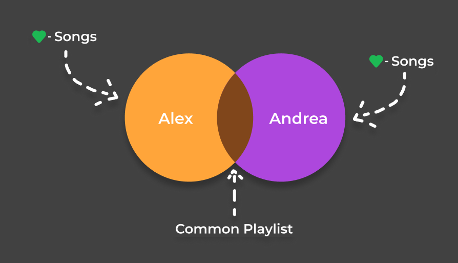

# Spot the Pie (Common-Pie)

Create a playlist with music both you and your friend like. For Spotify and Apple Music.

Try it out: https://spot-the-pie.schleo.com/

> Update: Spotify has now implemented their own feature called Spotify Blend Playlists, which makes this project somewhat redundant. That's why I shut down the backend. The frontend is still available for reference, but it won't work without the backend.

## Overview

Spot the Pie is a web app that pairs two users using a matching code and creates a common playlist from saved tracks.



## Architecture

### Components

- Frontend (`src/`): Vue 2 SPA with routes for landing, match success, result, and privacy policy.
- Backend (currently in other repo): Express API handling matching, auth handoff, track fetch, and playlist generation.
- Redis: temporary session/state store keyed by 6-digit matching code (TTL-based).
- Music providers: Spotify and Apple Music APIs.

### End-to-end flow

1. User opens frontend, receives a 6-digit code from `GET /myMatchingCode`.
2. Two users pair with `POST /match`; frontend polls `POST /amIMatched`.
3. Each user authenticates with Spotify (`GET /loginSpotify`) or Apple Music (MusicKit token).
4. Frontend sends provider token to `POST /fetchSavedTracks`; backend fetches liked/saved tracks and stores ISRCs in Redis.
5. Frontend polls `POST /commonPlaylist`.
6. Backend waits until both users are ready, intersects ISRC lists, creates one playlist on the selected provider, then stores playlist identifier.
7. If needed, second user is subscribed/followed to the same playlist.

### State model (Redis)

- Per matching code hash stores fields like `matchedWith`, `musicApi`, `savedTrackISRCs`, `progress`, `creatingCommonPlaylist`, `playlistCreationDone`, and `commonPlaylistIdentifier`.
- Match codes and transient data expire automatically (1-hour TTL), so stale sessions self-clean.

## Local setup

1. Start backend (see backend repo).

2. Start frontend:

```bash
yarn install
yarn serve
```

Frontend backend URL is configured via `.env`:

```env
VUE_APP_BACKEND_URL=http://localhost:3000
```
